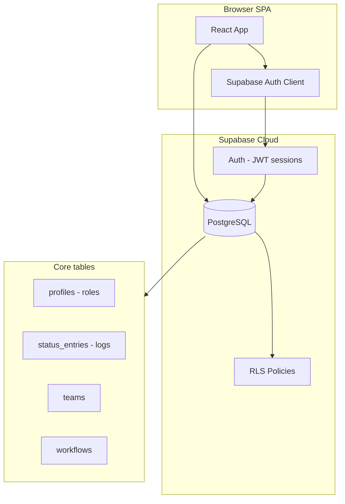
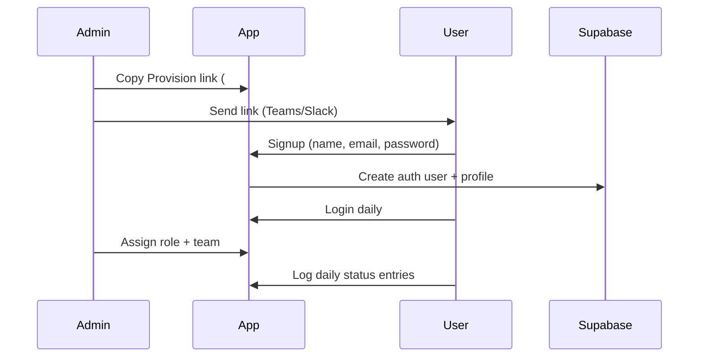

# CBPET Daily Tracker — Open Source Implementation Guide (Top to End)

Complete guide to fork, configure, deploy, and operate this project as an **internal team performance tracker** with multi-user auth, RBAC, and Supabase backend.

---

## Table of contents

1. [What this project is](#1-what-this-project-is)
2. [Architecture](#2-architecture)
3. [Prerequisites](#3-prerequisites)
4. [Quick start (30 minutes)](#4-quick-start-30-minutes)
5. [Supabase project setup](#5-supabase-project-setup)
6. [Database migrations](#6-database-migrations)
7. [Authentication configuration](#7-authentication-configuration)
8. [Environment variables](#8-environment-variables)
9. [Local development](#9-local-development)
10. [Multi-user onboarding](#10-multi-user-onboarding)
11. [Roles and permissions](#11-roles-and-permissions)
12. [Production deployment](#12-production-deployment)
13. [Email setup (optional)](#13-email-setup-optional)
14. [Security checklist](#14-security-checklist)
15. [Troubleshooting](#15-troubleshooting)
16. [Project structure reference](#16-project-structure-reference)
17. [Related documentation](#17-related-documentation)
18. [License and contributing](#18-license-and-contributing)

---

## 1. What this project is

**Daily Tracker** is a web app for teams to:

- Log daily work (pages completed, task type, time efficiency)
- View analytics dashboards and leaderboards
- Manage users, teams, and workflows with **Role-Based Access Control (RBAC)**

| Layer | Technology |
|-------|------------|
| Frontend | React 18, Vite 6, Tailwind CSS |
| Charts | Chart.js |
| Backend | Supabase (Auth + PostgreSQL) |
| Security | Row Level Security (RLS) on all tables |
| Deploy | Static build → GitHub Pages (or any static host) |

**Best for:** internal teams (10–500 users), not public SaaS signup.

---

## 2. Architecture



**Auth flow (simplified):**

```text
Signup / Login → Supabase Auth → JWT session
              → profiles row (role, team)
              → RLS filters data per role
```

**No custom backend server required.** The React app talks directly to Supabase using the public `anon` key; permissions are enforced by RLS.

---

## 3. Prerequisites

| Requirement | Version / notes |
|-------------|-----------------|
| Node.js | 20+ recommended |
| npm | Comes with Node |
| Git | For clone/fork |
| Supabase account | Free tier works for small teams |
| Browser | Chrome, Edge, or Firefox |

Optional:

- Custom domain for production
- SMTP provider (Resend, Gmail) for password-reset emails
- GitHub account for Pages deployment

---

## 4. Quick start (30 minutes)

### Step 1 — Fork and clone

```bash
git clone https://github.com/YOUR_ORG/Daily-Tracker.git
cd Daily-Tracker
npm install
```

### Step 2 — Create Supabase project

1. Go to [https://supabase.com/dashboard](https://supabase.com/dashboard)
2. **New project** → choose region → set database password
3. Wait for project to finish provisioning

### Step 3 — Run database SQL

In **SQL Editor**, run (in order):

1. `sql_commands/FRESH_SUPABASE_SETUP.sql` — **recommended for new projects**
2. `sql_commands/WORKFLOW_SETUP.sql`
3. `sql_commands/RLS_PROFILE_ROLE_FIX.sql`

See [Section 6](#6-database-migrations) for alternative migration paths.

### Step 4 — Configure auth URLs

**Authentication → URL Configuration:**

| Field | Local dev example |
|-------|-------------------|
| Site URL | `http://localhost:5173/Daily-Tracker/` |
| Redirect URLs | `http://localhost:5173/Daily-Tracker/` |

**Authentication → Providers → Email:**

- Enable Email provider: **ON**
- Confirm email: **OFF** (recommended for internal teams)

### Step 5 — Environment file

```bash
cp .env.example .env
```

Edit `.env`:

```env
VITE_SUPABASE_URL=https://YOUR_PROJECT.supabase.co
VITE_SUPABASE_ANON_KEY=your-anon-key
```

Keys: **Project Settings → API → Project URL** and **anon public**.

### Step 6 — Run locally

```bash
npm run dev
```

Open: [http://localhost:5173/Daily-Tracker/](http://localhost:5173/Daily-Tracker/)

### Step 7 — Create first admin

1. Open `#signup` → register with your real email and password  
   Example: `http://localhost:5173/Daily-Tracker/#signup`
2. In Supabase **SQL Editor**:

```sql
UPDATE public.profiles
SET role = 'super_admin', performer_name = 'Your Name'
WHERE email = 'you@yourcompany.com';
```

3. Log in → you should see **User Management** tab.

---

## 5. Supabase project setup

### 5.1 Get API credentials

| Key | Where | Used in |
|-----|-------|---------|
| Project URL | Settings → API | `VITE_SUPABASE_URL` |
| anon public | Settings → API | `VITE_SUPABASE_ANON_KEY` |
| service_role | Settings → API | **Never** put in frontend |

### 5.2 Auth settings summary

| Setting | Internal team recommendation |
|---------|------------------------------|
| Confirm email | OFF — users log in immediately after signup |
| Secure password change | ON |
| Flow | Implicit (configured in `src/lib/supabase.js`) |
| Signup | ON (invite via `#signup` link) |

### 5.3 Redirect URLs (critical)

The app is built with Vite `base: '/Daily-Tracker/'`. Auth email links must use the **base path without extra hash fragments**.

**Correct redirect URL for emails:**

```text
http://localhost:5173/Daily-Tracker/
https://your-domain.com/Daily-Tracker/
```

**Do not** use `#login` in Supabase email redirect config — it causes broken URLs like `#login#access_token=...`.

Production example (GitHub Pages):

```text
https://yourusername.github.io/Daily-Tracker/
```

---

## 6. Database migrations

### Option A — Fresh install (recommended)

Run in **Supabase SQL Editor**, in this order:

| Order | File | Purpose |
|-------|------|---------|
| 1 | `sql_commands/FRESH_SUPABASE_SETUP.sql` | Full schema, RLS, triggers, teams, metrics |
| 2 | `sql_commands/WORKFLOW_SETUP.sql` | Workflows and assignments |
| 3 | `sql_commands/RLS_PROFILE_ROLE_FIX.sql` | Email on profiles, role protection trigger |

Verify:

```bash
# Optional verification script
sql_commands/FRESH_SUPABASE_VERIFY.sql
```

### Option B — Incremental (existing database)

| Order | File | Purpose |
|-------|------|---------|
| 1 | `sql_commands/AUTH_SETUP.sql` | Base tables and RLS |
| 2 | `sql_commands/RBAC_MIGRATION.sql` | Enterprise 5-role RBAC |
| 3 | `sql_commands/WORKFLOW_SETUP.sql` | Workflows |
| 4 | `sql_commands/RLS_PROFILE_ROLE_FIX.sql` | Security hardening |

### What gets created automatically

When a user signs up, trigger `handle_new_user` creates:

```text
auth.users  →  public.profiles (role = performer, email synced)
```

### Promote users to admin

```sql
-- By email (after RLS_PROFILE_ROLE_FIX.sql)
UPDATE public.profiles
SET role = 'super_admin'
WHERE email = 'admin@yourcompany.com';

-- Or by UUID
UPDATE public.profiles
SET role = 'general_manager'
WHERE id = 'USER_UUID_HERE';
```

---

## 7. Authentication configuration

### 7.1 Supported user flows

| Flow | How | When to use |
|------|-----|-------------|
| **Signup link** | Admin shares `#signup` URL | Primary — internal onboarding |
| **Login** | Email + password | Daily access |
| **Change password** | 🔒 icon in app header | Preferred password update |
| **Forgot password** | Login → Recover? | Optional email reset |
| **Admin add user** | User Management → Add New User | Admin creates account |

### 7.2 Invite link format

```text
https://your-domain.com/Daily-Tracker/#signup
```

Admin copies this from **User Management → Provision User**.

### 7.3 Password change (in-app)

After login:

1. Click **🔒** in the top navigation
2. Enter current password + new password
3. Save

No email required.

### 7.4 Email confirmation links

If **Confirm email** is ON, clicking the email link should:

1. Parse `#access_token=...&type=signup` from URL
2. Log user into the app automatically

If links fail, turn **Confirm email OFF** for internal use (recommended).

### 7.5 Auth code locations

| File | Role |
|------|------|
| `src/lib/supabase.js` | Supabase client (implicit flow) |
| `src/lib/authRedirect.js` | Email redirect URLs, hash token parsing |
| `src/App.jsx` | Session bootstrap, routing |
| `src/components/Login.jsx` | Login form |
| `src/components/Signup.jsx` | Registration |
| `src/components/ForgotPassword.jsx` | Email reset request |
| `src/components/ResetPassword.jsx` | Set new password from email link |
| `src/components/ChangePassword.jsx` | In-app password change |

---

## 8. Environment variables

| Variable | Required | Description |
|----------|----------|-------------|
| `VITE_SUPABASE_URL` | Yes | Supabase project URL |
| `VITE_SUPABASE_ANON_KEY` | Yes | Public anon key (safe for browser) |

Create from template:

```bash
cp .env.example .env
```

**Never commit `.env`** — it is in `.gitignore`.

---

## 9. Local development

```bash
npm install          # once
npm run dev          # dev server → http://localhost:5173/Daily-Tracker/
npm run build        # production build → dist/
npm run preview      # preview production build locally
```

### Change base path (optional)

If you deploy to domain root instead of `/Daily-Tracker/`, edit `vite.config.js`:

```javascript
export default defineConfig({
  plugins: [react()],
  base: '/',  // was '/Daily-Tracker/'
});
```

Then update Supabase redirect URLs to match.

### Hash routes

| Hash | Screen |
|------|--------|
| `#landing` | Landing page |
| `#login` | Login |
| `#signup` | Signup |
| `#forgot-password` | Forgot password |

---

## 10. Multi-user onboarding

### Recommended internal workflow



### Step-by-step

1. **Admin** logs in as `super_admin` or `general_manager`
2. **User Management → Provision User** → copy `#signup` link
3. **New user** opens link → registers
4. **Admin** refreshes User Management → sets role and team
5. **User** logs work on **Entry Form** tab

### Alternative: Admin creates user

**User Management → Add New User** → enter email, name, role.

User receives confirmation email (if SMTP configured) or admin shares login instructions.

---

## 11. Roles and permissions

### Role hierarchy

| Role | Code | Access |
|------|------|--------|
| Super Admin | `super_admin` | Full system control, user CRUD, workflows |
| General Manager | `general_manager` | All data, user management |
| Assistant Manager | `assistant_manager` | Multi-team oversight |
| Team Lead | `team_lead` | Own team data |
| Performer | `performer` | Own entries only |

### UI features by role

| Feature | super_admin / general_manager | team_lead | performer |
|---------|------------------------------|-----------|-----------|
| Entry Form | Yes | Yes | Yes |
| Analytics | All data | Team data | Own data |
| User Management | Yes | No | No |
| Workflow Management | Yes | No | No |
| Change password (🔒) | Yes | Yes | Yes |
| Admin reset (🔑) | Yes | No | No |

Permissions are enforced at **database level** via RLS — not only in the UI.

Details: [RBAC_OVERVIEW.md](./RBAC_OVERVIEW.md)

---

## 12. Production deployment

### Option A — GitHub Pages (included CI/CD)

1. Fork repo to your GitHub account
2. **Settings → Pages → Source:** GitHub Actions
3. Add repository secrets (for build-time env):

   | Secret | Value |
   |--------|-------|
   | `VITE_SUPABASE_URL` | Your Supabase URL |
   | `VITE_SUPABASE_ANON_KEY` | Your anon key |

4. Push to `main` → workflow `.github/workflows/deploy.yml` deploys automatically
5. Live URL: `https://YOUR_USERNAME.github.io/Daily-Tracker/`

Update Supabase redirect URLs to production URL.

### Option B — Any static host

```bash
npm run build
# Upload contents of dist/ to Netlify, Vercel, S3, nginx, etc.
```

Set environment variables at **build time** (Vite embeds `VITE_*` vars).

### Post-deploy checklist

- [ ] Supabase Site URL = production app URL
- [ ] Redirect URLs include production base path
- [ ] Confirm email OFF (internal) or SMTP configured (external)
- [ ] First super_admin promoted via SQL
- [ ] Test login, signup, entry form, dashboard

Full checklist: [DEPLOYMENT_CHECKLIST.md](./DEPLOYMENT_CHECKLIST.md)

---

## 13. Email setup (optional)

Email is **not required** for internal teams if you:

- Use **Provision User** (`#signup`) for onboarding
- Turn **Confirm email OFF**
- Use **in-app 🔒 Change Password**

Configure SMTP only if you need **Forgot Password** or **admin email invites**.

| Guide | Use case |
|-------|----------|
| [EMAIL_SETUP_GUIDE.md](./EMAIL_SETUP_GUIDE.md) | Overview, Resend, redirect URLs |
| [GMAIL_SMTP_SETUP.md](./GMAIL_SMTP_SETUP.md) | Gmail / Google Workspace SMTP |

---

## 14. Security checklist

- [ ] Never expose `service_role` key in frontend or git
- [ ] Run `RLS_PROFILE_ROLE_FIX.sql` (prevents role self-promotion)
- [ ] Use real company emails for production users
- [ ] Restrict app URL (VPN / internal network) if sensitive
- [ ] Rotate Supabase keys if leaked
- [ ] Review RLS policies after schema changes
- [ ] Keep Supabase project on paid plan for production (no auto-pause)

---

## 15. Troubleshooting

| Problem | Cause | Fix |
|---------|-------|-----|
| Blank page after deploy | Wrong Vite `base` path | Match `vite.config.js` base to hosting path |
| Login works locally, not production | Redirect URL mismatch | Add production URL in Supabase |
| `#login#access_token=...` broken link | Old email redirect with hash | Use base URL only; see `getAuthRedirectUrl()` |
| PKCE code verifier error | Old PKCE config | Project uses implicit flow now — request new email |
| User created but role is performer | Expected default | Admin updates role in User Management |
| Cannot see User Management tab | Not admin | `UPDATE profiles SET role = 'super_admin' ...` |
| Email not received | No SMTP / rate limit | See EMAIL_SETUP_GUIDE or disable confirm email |
| 401 on data insert | RLS or missing profile | Check profile row exists for user UUID |
| Signup link opens login, not signup | Wrong hash | Use `#signup` explicitly |

### Useful SQL debug queries

```sql
-- List users and roles
SELECT id, email, performer_name, role, team_id FROM public.profiles ORDER BY role;

-- Check auth users
SELECT id, email, created_at FROM auth.users ORDER BY created_at DESC;

-- Entries for a user
SELECT * FROM public.status_entries WHERE user_id = 'USER_UUID' LIMIT 10;
```

---

## 16. Project structure reference

```text
Daily-Tracker/
├── .github/workflows/deploy.yml    # GitHub Pages CI/CD
├── .env.example                    # Environment template
├── sql_commands/
│   ├── FRESH_SUPABASE_SETUP.sql    # Full DB setup (new projects)
│   ├── WORKFLOW_SETUP.sql          # Workflows
│   ├── RLS_PROFILE_ROLE_FIX.sql    # Auth security hardening
│   ├── AUTH_SETUP.sql              # Legacy base schema
│   └── RBAC_MIGRATION.sql          # Legacy RBAC upgrade
├── src/
│   ├── App.jsx                     # Main app, auth routing, RBAC UI
│   ├── lib/
│   │   ├── supabase.js             # Supabase client
│   │   └── authRedirect.js         # Email link / hash handling
│   └── components/
│       ├── Login.jsx / Signup.jsx
│       ├── ForgotPassword.jsx / ResetPassword.jsx
│       ├── ChangePassword.jsx      # In-app password change
│       ├── Dashboard.jsx           # Analytics
│       ├── UserManagement.jsx      # Admin users
│       └── WorkflowManager.jsx     # Workflows
├── docs/                           # All documentation
└── vite.config.js                  # base: '/Daily-Tracker/'
```

---

## 17. Related documentation

| Document | Topic |
|----------|-------|
| [SETUP_GUIDE.md](./SETUP_GUIDE.md) | Short setup notes |
| [FIRST_USER_SETUP_GUIDE.md](./FIRST_USER_SETUP_GUIDE.md) | Bootstrap first admin |
| [ADD_NEW_USER_GUIDE.md](./ADD_NEW_USER_GUIDE.md) | Admin user creation |
| [INVITE_LINK_FIRST_TIME_PASSWORD_GUIDE.md](./INVITE_LINK_FIRST_TIME_PASSWORD_GUIDE.md) | Signup invite flow |
| [PASSWORD_MANAGEMENT.md](./PASSWORD_MANAGEMENT.md) | Password flows |
| [RBAC_OVERVIEW.md](./RBAC_OVERVIEW.md) | Role system |
| [WORKFLOW_IMPLEMENTATION.md](./WORKFLOW_IMPLEMENTATION.md) | Workflows |
| [DEPLOYMENT_CHECKLIST.md](./DEPLOYMENT_CHECKLIST.md) | Production checklist |
| [EMAIL_SETUP_GUIDE.md](./EMAIL_SETUP_GUIDE.md) | SMTP / email |
| [GMAIL_SMTP_SETUP.md](./GMAIL_SMTP_SETUP.md) | Gmail SMTP |

---

## 18. License and contributing

### Open source usage

This project can be forked and self-hosted for your organization. Typical steps:

1. Fork the repository
2. Replace branding in `LandingPage.jsx` / `index.html` if desired
3. Run your own Supabase project (data stays in your account)
4. Deploy to your static host
5. Choose a license (MIT is common for open source) and add a `LICENSE` file

### Contributing

1. Fork → feature branch → pull request
2. Run `npm run build` before submitting
3. Document SQL changes in `sql_commands/`
4. Do not commit `.env` or secrets

### Support model

| Layer | Owner |
|-------|-------|
| App code | Your fork / maintainers |
| Supabase infra | Supabase |
| User data | Your Supabase project |
| SMTP email | Your email provider |

---

## Appendix — Target benchmarks (8-hour day)

| Task Type | Target |
|-----------|--------|
| Prestyle | 900 pages |
| Preedit | 300 pages |
| FL Validation | 600 pages |
| Revises Validation | 1,200 pages |
| Normalisation | 300 pages |
| Cast-off XML Conversion | 4 titles |
| Ref Edit | 400 references |
| Style Editing | 80 pages |

---

*Last updated: June 2026*
