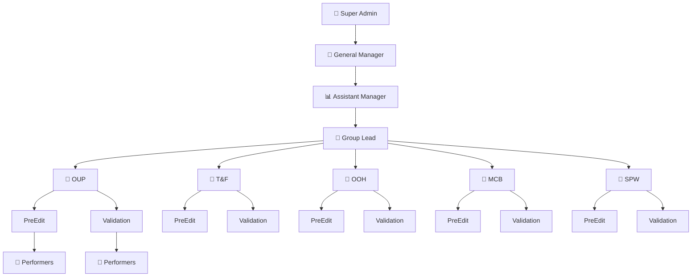

# Hierarchical Client Structure & Group Lead Provisioning

Restructure the Daily Tracker to support a **Group Lead → Client → Sub-division** hierarchy, with restricted provisioning to General Manager and Assistant Manager only.

## Proposed Hierarchy



## User Review Required

> [!IMPORTANT]
> **New role `group_lead`**: This replaces the existing `team_lead` role in the hierarchy. Group leads sit below Assistant Manager and above Performers. Each group lead oversees performers across one or more clients.
>
> Should existing `team_lead` users be migrated to `group_lead`, or do you want **both** roles to co-exist?

> [!WARNING]
> **Database migration required**: You'll need to run a SQL migration in your Supabase dashboard. This adds a new `clients` table and modifies the `profiles` table. I'll provide the exact SQL to run.

> [!IMPORTANT]
> **Sub-division model**: Each client has exactly two sub-divisions: **PreEdit** and **Validation**. A performer is assigned to one client + one sub-division. Is this correct, or can a performer belong to multiple clients/sub-divisions?

## Open Questions

> [!IMPORTANT]
> 1. **Group Lead scope**: Does a Group Lead manage performers across ALL clients, or only specific assigned clients?
> 2. **Entry form**: When a performer logs an entry, should the client and sub-division be auto-filled from their profile, or should they be able to select it?
> 3. **Existing data**: Your current `profiles.client_id` is a text field with values like `'DEFAULT_CLIENT'`. Should we migrate existing users to one of the new clients?

---

## Proposed Changes

### Database Migration (Supabase SQL)

#### [NEW] SQL Migration Script

Create a new `clients` table and add `sub_division` to profiles:

```sql
-- 1. Add 'group_lead' to user_role enum
ALTER TYPE public.user_role ADD VALUE IF NOT EXISTS 'group_lead' BEFORE 'team_lead';

-- 2. Create clients table
CREATE TABLE IF NOT EXISTS public.clients (
  id uuid PRIMARY KEY DEFAULT gen_random_uuid(),
  code text NOT NULL UNIQUE,         -- e.g., 'OUP', 'T&F'
  name text NOT NULL,                -- e.g., 'Oxford University Press'
  is_active boolean NOT NULL DEFAULT true,
  created_at timestamptz NOT NULL DEFAULT now(),
  updated_at timestamptz NOT NULL DEFAULT now()
);

-- 3. Seed the 5 clients
INSERT INTO public.clients (code, name) VALUES
  ('OUP', 'OUP'),
  ('T&F', 'T&F'),
  ('OOH', 'OOH'),
  ('MCB', 'MCB'),
  ('SPW', 'SPW')
ON CONFLICT (code) DO NOTHING;

-- 4. Add sub_division to profiles
ALTER TABLE public.profiles
  ADD COLUMN IF NOT EXISTS sub_division text DEFAULT NULL
  CHECK (sub_division IN ('PreEdit', 'Validation', NULL));

-- 5. Add client reference (keep existing client_id text for backward compat,
--    add new FK column)
ALTER TABLE public.profiles
  ADD COLUMN IF NOT EXISTS client_ref uuid REFERENCES public.clients(id) ON DELETE SET NULL;

-- 6. Add sub_division to status_entries
ALTER TABLE public.status_entries
  ADD COLUMN IF NOT EXISTS sub_division text DEFAULT NULL;

-- 7. RLS for clients table
ALTER TABLE public.clients ENABLE ROW LEVEL SECURITY;

-- Everyone can read clients
CREATE POLICY "clients_select_authenticated" ON public.clients
  FOR SELECT TO authenticated USING (true);

-- Only GM and AM can manage clients
CREATE POLICY "clients_manage_gm_am" ON public.clients
  FOR ALL TO authenticated
  USING (
    EXISTS (
      SELECT 1 FROM public.profiles p
      WHERE p.id = auth.uid()
        AND p.role IN ('super_admin', 'general_manager', 'assistant_manager')
    )
  )
  WITH CHECK (
    EXISTS (
      SELECT 1 FROM public.profiles p
      WHERE p.id = auth.uid()
        AND p.role IN ('super_admin', 'general_manager', 'assistant_manager')
    )
  );

-- 8. Timestamps trigger for clients
CREATE TRIGGER set_updated_at_clients
  BEFORE UPDATE ON public.clients
  FOR EACH ROW EXECUTE FUNCTION public.set_updated_at();

-- 9. Indexes
CREATE INDEX IF NOT EXISTS idx_profiles_client_ref ON public.profiles (client_ref);
CREATE INDEX IF NOT EXISTS idx_profiles_sub_division ON public.profiles (sub_division);
CREATE INDEX IF NOT EXISTS idx_clients_active ON public.clients (is_active) WHERE is_active = true;
```

---

### Frontend — New Component: Client Management

#### [NEW] [ClientManagement.jsx](file:///d:/Daily-Tracker/src/components/ClientManagement.jsx)

A new admin panel (visible only to GM & AM) with:

- **Clients list**: Table showing all clients (OUP, T&F, OOH, MCB, SPW) with status badges
- **Add/Edit client**: Modal form with `code` and `name` fields
- **Performer grouping**: Under each client, show two sections (PreEdit / Validation) with assigned performers
- **Assign performers**: Dropdown to assign unassigned performers to a client + sub-division
- CRUD operations call Supabase `clients` table

---

### Frontend — Profile & Entry Form Updates

#### [MODIFY] [App.jsx](file:///d:/Daily-Tracker/src/App.jsx)

| Change | Details |
|---|---|
| **New state** | Add `clients` state, `fetchClients()` function |
| **Entry form** | Add Client and Sub-division dropdowns (auto-filled from profile for performers, selectable for managers) |
| **Role check** | Update `canSelectPerformerOnForm` to include `group_lead` |
| **New admin tab** | Add "Client Management" sub-tab under Admin panel |
| **Provisioning guard** | Only `general_manager` and `assistant_manager` can add/edit clients and group performers |
| **Status entry** | Include `sub_division` in `newEntry` and `syncToSupabase` |

**Entry form changes (lines ~825-882)**:
```jsx
{/* Client dropdown — auto-filled for performers, selectable for managers */}
<div>
  <label>Client</label>
  {isPerformerOrGroupLead ? (
    <input type="text" value={profile.client_code} readOnly />
  ) : (
    <select value={selectedClient} onChange={...}>
      {clients.map(c => <option key={c.id} value={c.code}>{c.code}</option>)}
    </select>
  )}
</div>

{/* Sub-division dropdown */}
<div>
  <label>Sub-division</label>
  {isPerformer ? (
    <input type="text" value={profile.sub_division} readOnly />
  ) : (
    <select value={subDivision} onChange={...}>
      <option value="PreEdit">PreEdit</option>
      <option value="Validation">Validation</option>
    </select>
  )}
</div>
```

---

#### [MODIFY] [DailySummary.jsx](file:///d:/Daily-Tracker/src/components/DailySummary.jsx)

- Add client and sub-division filter options for managers
- Show client & sub-division badges on each entry card
- Group entries by Client → Sub-division → Task Type

---

#### [MODIFY] [Dashboard.jsx](file:///d:/Daily-Tracker/src/components/Dashboard.jsx)

- Replace hardcoded `client_id` text filtering with proper client code filtering
- Add sub-division breakdown in charts

---

#### [MODIFY] [UserManagement.jsx](file:///d:/Daily-Tracker/src/components/UserManagement.jsx)

- Add `group_lead` to role options
- Add Client and Sub-division assignment columns
- Restrict provisioning actions to GM and AM only

---

#### [MODIFY] [targetUtils.js](file:///d:/Daily-Tracker/src/lib/targetUtils.js)

- Fix the `aggregateDayMetrics` function to use **weighted average** by `takenTime`

---

### Access Control Summary

| Action | Super Admin | General Manager | Assistant Manager | Group Lead | Performer |
|---|---|---|---|---|---|
| Add/Edit Clients | ✅ | ✅ | ✅ | ❌ | ❌ |
| Group Performers to Client | ✅ | ✅ | ✅ | ❌ | ❌ |
| Assign Sub-division | ✅ | ✅ | ✅ | ❌ | ❌ |
| View all performers | ✅ | ✅ | ✅ | Own group only | ❌ |
| Log entry for others | ✅ | ✅ | ✅ | ❌ | ❌ |
| Entry form performer dropdown | All users | All users | All users | Read-only (self) | Read-only (self) |

---

## Verification Plan

### Database
- Run migration SQL in Supabase → verify `clients` table created with 5 entries
- Verify `profiles.sub_division` and `profiles.client_ref` columns exist
- Test RLS: Performer cannot modify `clients`, GM can

### Manual Verification
- **GM login**: Can see Client Management tab, add/edit clients, assign performers to Client + Sub-division
- **AM login**: Same as GM for client provisioning
- **Group Lead login**: Can see their assigned performers, entry form shows read-only client/sub-division
- **Performer login**: Entry form shows read-only client + sub-division from their profile
- **Entry form**: Verify `sub_division` is saved with each status entry
- **Daily Summary**: Check weighted average calculations are correct
